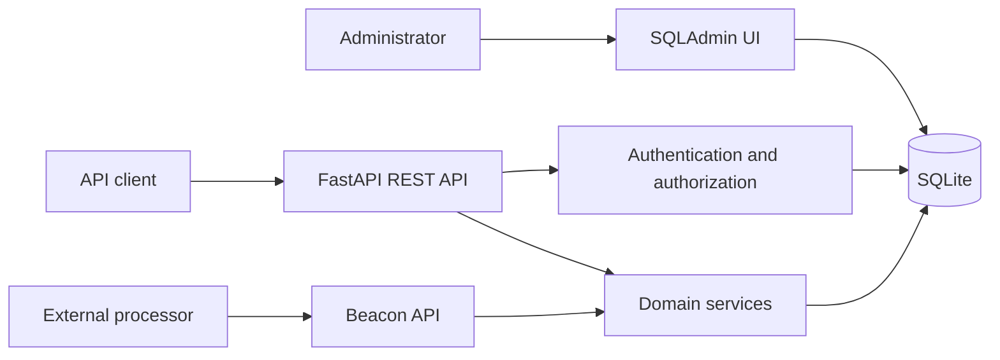

# Architecture

## Overview

Atrecovery Service is a Python 3.11+ asynchronous FastAPI application for
managing routines, the resources on which they may be used, and the access
controls around both. It records dispatch requests and receives execution
results from external processor services; it does not execute routines itself.

The application is a modular monolith. Its REST API, administrative UI, domain
logic, and SQLite persistence run in one process. The default deployment is a
local Uvicorn process backed by `data/app.db`.

## Runtime Composition

`app/main.py` creates the FastAPI application and is the runtime entry point
(`uvicorn app.main:app`). During its lifespan it configures logging, creates
registered database tables, and disposes the async engine during shutdown.

The application exposes:

- System endpoints: `/`, `/health`, and `/version`.
- Versioned REST endpoints under `/api/v1`.
- Generated OpenAPI documentation at `/docs`.
- A session-authenticated SQLAdmin interface at `/admin`.

Middleware supplies a request ID, signed session support for the admin UI, and
configurable CORS. Settings are loaded by `app/core/config.py` from environment
variables or `.env`; they include the database URL, JWT settings, CORS origins,
and logging level.

## Layering

| Layer | Location | Responsibility |
|---|---|---|
| HTTP composition | `app/main.py`, `app/api/v1/` | Router registration, request handling, response contracts, and dependency injection. |
| Core | `app/core/` | Settings, JWT/password security, authentication dependencies, coarse RBAC checks, logging, and time helpers. |
| Domain services | `app/services/` | Object-level authorization, JSON Schema validation, usage creation, activity logging, and inventory import. |
| Data model | `app/models/`, `app/db/` | SQLAlchemy ORM models, async engine/session lifecycle, table initialization, and demo seed data. |
| API contracts | `app/schemas/` | Pydantic input and output schemas. |
| Administration | `app/admin/`, `templates/sqladmin/` | SQLAdmin views and local session authentication. |
| Tests and docs | `tests/`, `docs/` | Async API tests, usage tutorial, and entity relationship documentation. |

Routers generally coordinate validation, authorization, persistence, and audit
activity. Reusable business rules live in services instead of being duplicated
across routes or the admin import UI.

## API Domains

The API is partitioned by domain in `app/api/v1/`:

- `auth`: OAuth2 password login, JWT refresh, and the currently stubbed business
  SSO provider flow.
- `users` and `roles`: users, roles, permissions, and external identities.
- `categories` and `routines`: categorized, versioned routine definitions.
- `resource-types`, `metadata-types`, and `resources`: typed inventory resources,
  metadata, routine associations, and bulk import.
- `resource-groups` and `grants`: resource grouping and object-level access
  grants.
- `execution-modes` and `usages`: dispatch records for direct, scheduled, or
  voucher use.
- `processors` and `beacons`: processor registration and processor-reported
  execution results.
- `activity-logs`: read access to the audit trail.

## Authentication And Authorization

Human users authenticate with the OAuth2 password flow. `app/core/security.py`
creates and verifies JWT access and refresh tokens; passwords are bcrypt hashed.
`get_current_user` in `app/core/deps.py` resolves an active user from an access
token.

Authorization has two levels:

- Coarse RBAC: user-to-role-to-permission mappings guard API operations through
  `require_permission`. Superusers bypass these permission checks.
- Object-level grants: `app/services/rbac.py` evaluates deny-by-default view/use
  access for individual routines and resources. Grants may target users, roles,
  or resource groups. Group membership and group principal assignments extend
  resource access.

External processors use `X-Processor-Token`, not JWTs. Only a SHA-256 hash of a
processor token is stored; comparisons use `hmac.compare_digest`. Raw processor
tokens are intentionally shown only at creation time.

The SQLAdmin UI uses a separate signed session and local username/password
login. Access requires an active superuser or the `admin:manage` permission.

## Core Data Model

Persistence uses SQLAlchemy 2 with an async `aiosqlite` engine. The default
database is SQLite at `data/app.db`. `app/db/session.py` provides the FastAPI
`get_db` session dependency and creates the data directory when needed.

Key aggregates and relationships are:

- Identity: `users`, `roles`, `permissions`, role/user association tables, and
  `auth_identities` for external identity links.
- Catalog: a `routine_category` can define an input JSON Schema; each routine
  belongs to a category and stores JSON `content` validated against that schema.
- Inventory: resource types define JSON Schemas for resource `data`; metadata
  types define schemas for separately stored resource metadata. A resource can
  have multiple metadata entries.
- Compatibility: `resource_routines` is a closed-world association. A usage may
  be created only for an explicitly associated routine/resource pair.
- Access: groups contain resources, group assignments identify allowed
  principals, and routine/resource grants provide view or use rights.
- Operations: execution modes classify `routine_usages`; processor services
  report `execution_results` through beacons. `activity_logs` records selected
  operational and administrative actions and is read-only through the API/admin.

See `docs/ER.md` for the detailed relationship diagram. It includes planned
`usage_limits` references that are not implemented in the current models.

## Usage And Processor Flow

1. An authenticated user creates a usage request for a routine and resource.
2. `app/services/usage_svc.py` verifies the execution mode, routine status,
   routine and resource grants, and the routine/resource association.
3. The service records a `routine_usage`. Direct requests begin as `dispatched`;
   scheduler and voucher requests begin as `pending`. Voucher requests receive a
   locally generated dispatch identifier.
4. A processor posts a beacon using its processor token. The beacon endpoint
   records an execution result and updates the associated usage as applicable.

Cron expressions for scheduler usage are validated and a next-fire timestamp
can be calculated as a read-time hint. There is no internal scheduler, queue,
routine executor, or outbound processor dispatch client. An external system is
responsible for acting on scheduled or dispatched work.

## Import And Validation Flow

`app/services/validation.py` applies JSON Schema validation to routine content,
resource data, and resource metadata. `app/services/resource_import.py` is the
shared path for CSV/JSON inventory import and the admin import page. It validates
the complete input set before atomically creating or updating `mobile_device`
resources and `monitor` metadata, preventing partial imports.

## Database Lifecycle

On startup, `init_db()` calls `Base.metadata.create_all()`. There is no migration
framework. The only existing compatibility action is a best-effort SQLite
`ALTER TABLE` that adds `processor_services.details` if absent. Schema changes
therefore require deliberate handling of existing databases; `create_all()` does
not evolve tables generally.

`python -m app.db.seed` initializes demo users, RBAC data, catalog and inventory
examples, grants, execution modes, and a processor service. It is intended for
local development.

## Administration

The SQLAdmin interface manages the same database through a synchronous SQLite
SQLAlchemy engine. It is mounted in the FastAPI process but does not share the
async API session factory. Administrative views provide CRUD for most domain
records; activity logs and execution results are read-only. The admin resource
import view delegates to the same import service used by REST endpoints.

## Testing And Quality

The test suite uses pytest with async support and `httpx2` ASGI clients. The
`client` fixture in `tests/conftest.py` creates and seeds a temporary SQLite
database for each test, so tests do not write to `data/app.db`.

Coverage includes API health, authentication/RBAC, catalog and schema
validation, inventory, grants, usages, beacons, imports, activity logs, and
admin behavior. Ruff is configured for linting. The project does not currently
define a type checker, coverage threshold, lockfile, CI workflow, container
image, or deployment manifests.

## Current Boundaries And Gaps

- The service records dispatch intent and results only; execution, scheduling,
  and external voucher reconciliation are outside this codebase.
- Business SSO support is a declared stub and returns `501`.
- SQLite is the default persistence option; production database migration and
  schema evolution strategy are not implemented.
- Production hardening such as secret enforcement, rate limiting, readiness and
  metrics endpoints, and refresh-token replay protection is not present.
