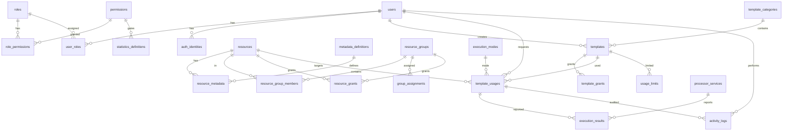

# Database ER — Template Management PoC

Final as of Stage 8 (mirrors `app/models/*.py`). Mermaid below renders in GitHub/VSCode.



Text version (same as plan.md §3.1, completed):

```
[roles] 1---* [role_permissions] *---1 [permissions]
[users] 1---* [user_roles] *---1 [roles]
[users] 1---* [auth_identities]
[template_categories] 1---* [templates] / [users] 1---* [templates] (created_by)
[resources] 1---* [resource_metadata] *---1 [metadata_definitions]
[resources] 1---* [resource_group_members] *---1 [resource_groups]
[resource_groups] 1---* [group_assignments] -> principal(user|role)
[templates] 1---* [template_grants] -> principal(user|role|group)
[resources|resource_groups] 1---* [resource_grants] -> principal(user|role|group)
[execution_modes] 1---* [template_usages]
[templates] 1---* [template_usages] *---1 [users(requested_by)] / [resources] 1---* [template_usages]
[templates] 1---* [usage_limits]
[template_usages] 1---* [execution_results] / [processor_services] 1---* [execution_results]
[users] 1---* [activity_logs] (+ usage/beacon rows reference template_usages)
[permissions] 1---* [statistics_definitions(required_permission_code)]
```

Notes:
- Execution is out-of-scope: `template_usages` only relay dispatch requests;
  `execution_results` are reported by external processors (`X-Processor-Token`).
- Grants complement coarse permission codes; group grants cover member resources.
- `activity_logs` is append-only (no update/delete API; read-only in `/admin`).
