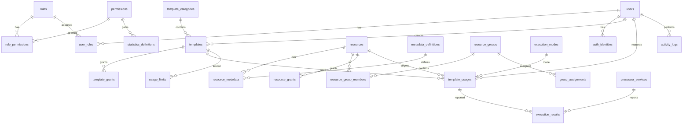

# Database ER — Template Management PoC

Source of truth: `plan.md §3`. Mermaid below mirrors it (render in GitHub/VSCode).



Text version (same as plan.md §3.1):

```
[roles] 1---* [role_permissions] *---1 [permissions]
[users] 1---* [user_roles] *---1 [roles]
[users] 1---* [auth_identities]
[template_categories] 1---* [templates]
[resources] 1---* [resource_metadata] *---1 [metadata_definitions]
[resources] 1---* [resource_group_members] *---1 [resource_groups]
[resource_groups] 1---* [group_assignments] -> principal(user|role)
[templates] 1---* [template_grants]
[execution_modes] 1---* [template_usages]
[templates] 1---* [template_usages] / [templates] 1---* [usage_limits]
[template_usages] 1---* [execution_results] / [processor_services] 1---* [execution_results]
[users] 1---* [activity_logs]
```
