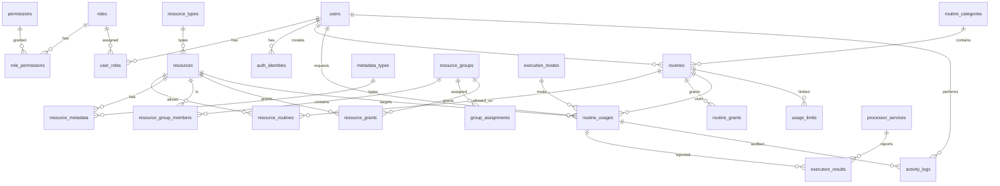

# Database ER — Atrecovery Service

Routines store JSON ``content`` validated against their category
``input_schema``; resources store JSON ``data`` validated against their
``resource_types.schema``; resource metadata entries store JSON ``data``
validated against their ``metadata_types.schema`` (multiple per resource).



Text version:

```
[roles] 1---* [role_permissions] *---1 [permissions]
[users] 1---* [user_roles] *---1 [roles]
[users] 1---* [auth_identities]
[routine_categories(input_schema)] 1---* [routines] / [users] 1---* [routines] (created_by)
  routines.content JSON validated by category input_schema
[resource_types] 1---* [resources] (resource.data JSON validated by type schema)
  e.g. mobile_device {"udid":"ZY323S5GHW","nombre":"Moto G6 3","plataforma":"android","version_plataforma":"8.0.0","descripcion":"random device"}
[resources] *---* [routines] via resource_routines (per-routine associations;
  a routine executes only against an associated resource — closed world)
[metadata_types] 1---* [resource_metadata] *---1 [resources] (metadata.data JSON validated by type schema)
  e.g. monitor {"monitor":"monitor-01","nodo":"nodo-lab","hostname":"moto-g6-3.lab","host":"10.0.0.31","servidor_log":"logs.lab.local"}
  (a resource can have multiple metadata entries, one per type)
[resources] 1---* [resource_group_members] *---1 [resource_groups]
[resource_groups] 1---* [group_assignments] -> principal(user|role)
[routines] 1---* [routine_grants] -> principal(user|role|group)
[resources|resource_groups] 1---* [resource_grants] -> principal(user|role|group)
[execution_modes] 1---* [routine_usages]
[routines] 1---* [routine_usages] *---1 [users(requested_by)] / [resources] 1---* [routine_usages]
  usages carry cron (scheduler recurrence, validated) + use_count (accepted beacons);
  beacons carry optional idem_key, unique per (usage_id, idem_key) for repeat-safe cron reports
[routines] 1---* [usage_limits]
[routine_usages] 1---* [execution_results] / [processor_services] 1---* [execution_results]
[users] 1---* [activity_logs] (+ usage/beacon rows reference routine_usages)
```

Notes:
- `routine_usages` relay dispatch requests; `execution_results` are reported
  by external processors (`X-Processor-Token`).
- Grants complement coarse permission codes; group grants cover member resources.
- `activity_logs` is append-only (no update/delete API; read-only in `/admin`).
- Schema change note: delete pre-existing `data/app.db` before reseeding
  (category input_schema, resources split into data JSON + typed metadata).
