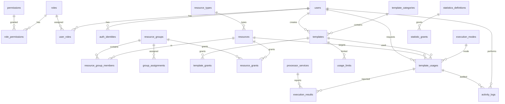

# Database ER — Template Management PoC

Templates store JSON ``content`` validated against ``input_schema`` (or the
category ``schema_hint``); resources store JSON ``data`` validated against
their ``resource_types.schema``. Statistics use per-principal grants
(``statistic_grants`` → user/role), not permission codes.



Text version:

```
[roles] 1---* [role_permissions] *---1 [permissions]
[users] 1---* [user_roles] *---1 [roles]
[users] 1---* [auth_identities]
[template_categories] 1---* [templates] / [users] 1---* [templates] (created_by)
  templates.content JSON validated by input_schema else category schema_hint
[resource_types] 1---* [resources] (resource.data JSON validated by type schema)
  e.g. mobile_device {"udid":"ZY323S5GHW","nombre":"Moto G6 3","plataforma":"android",...}
[resources] 1---* [resource_group_members] *---1 [resource_groups]
[resource_groups] 1---* [group_assignments] -> principal(user|role)
[templates] 1---* [template_grants] -> principal(user|role|group)
[resources|resource_groups] 1---* [resource_grants] -> principal(user|role|group)
[execution_modes] 1---* [template_usages]
[templates] 1---* [template_usages] *---1 [users(requested_by)] / [resources] 1---* [template_usages]
[templates] 1---* [usage_limits]
[template_usages] 1---* [execution_results] / [processor_services] 1---* [execution_results]
[users] 1---* [activity_logs] (+ usage/beacon rows reference template_usages)
[statistics_definitions] 1---* [statistic_grants] -> principal(user|role)
  (no stats permission codes; different users/roles see different stats)
```

Notes:
- Execution is out-of-scope: `template_usages` only relay dispatch requests;
  `execution_results` are reported by external processors (`X-Processor-Token`).
- Grants complement coarse permission codes; group grants cover member resources.
  Statistic visibility is grant-only (per user/role).
- `activity_logs` is append-only (no update/delete API; read-only in `/admin`).
- Schema change note: delete pre-existing `data/app.db` before reseeding
  (template content TEXT→JSON, resources collapsed to data JSON + types,
  `statistics_definitions.required_permission_code` removed).
